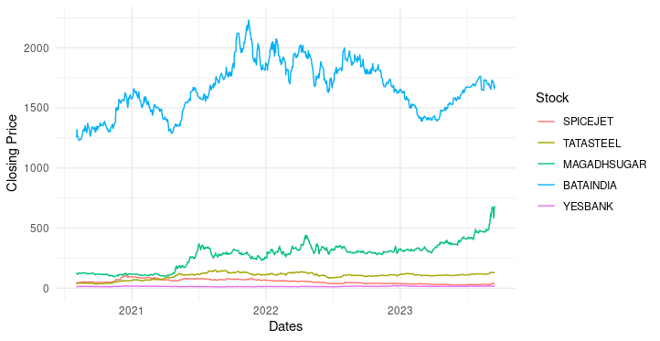

# What is it?
- SPCS stands for "Stock Price Comaprison Script".
- It is R script, which you can execute using Rstudio or any other IDE for R.

## R library Requirement:
- ggplot
- reshape2
- quantmod

